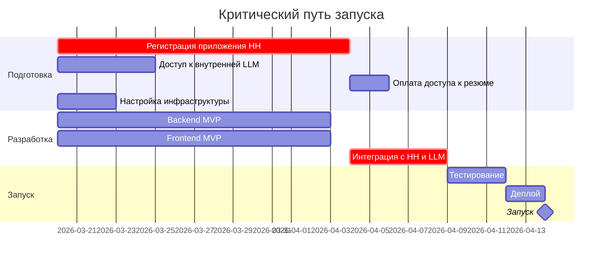

# Roadmap: Запуск HR-сервиса

## Введение

Этот документ описывает последовательность шагов для запуска HR-сервиса поиска кандидатов — от подготовки инфраструктуры до production-релиза.

**Связанные документы:**
- [Техническая спецификация.md](Техническая%20спецификация.md)
- [User Stories.md](User%20Stories.md)
- [Требования.md](Требования.md)
- [Регистрация приложения на HeadHunter.md](Регистрация%20приложения%20на%20HeadHunter.md)

---

## Фаза 0: Подготовка и регистрация

### 0.1 Регистрация приложения на HeadHunter

| Шаг | Действие | Ответственный | Срок рассмотрения |
|-----|----------|---------------|-------------------|
| 1 | Создать аккаунт работодателя на [hh.ru](https://hh.ru) (если нет) | Заказчик | 1 день |
| 2 | Перейти на [dev.hh.ru](https://dev.hh.ru) и авторизоваться | Заказчик | — |
| 3 | Заполнить заявку на регистрацию приложения | Разработчик + Заказчик | 1 день |
| 4 | Дождаться одобрения заявки | — | **до 15 рабочих дней** |
| 5 | Получить `client_id` и `client_secret` | — | — |

> ⚠️ **Важно:** HeadHunter может отказать в регистрации без объяснения причин. Рекомендуется подготовить детальное описание приложения и его целей.

**Подробная инструкция по заполнению формы:** [Регистрация приложения на HeadHunter.md](Регистрация%20приложения%20на%20HeadHunter.md)

### 0.2 Оплата доступа к базе резюме

| Услуга | Описание | Где оплатить |
|--------|----------|--------------|
| Доступ к базе резюме | Обязателен для поиска и просмотра резюме | Личный кабинет работодателя на hh.ru |
| Контакты кандидатов | Списываются при первом просмотре резюме | Входит в пакет услуг |

> 💰 Стоимость зависит от тарифа и региона. Уточнить в коммерческом отделе HH.

### 0.3 Подготовка инфраструктуры

| Сервис | Назначение | Рекомендация |
|--------|------------|--------------|
| **Хостинг Backend** | Python/FastAPI | Railway, Render, VPS |
| **Хостинг Frontend** | Next.js | Vercel (бесплатный tier) |
| **PostgreSQL** | База данных | Neon, Supabase, Railway |
| **Внутренняя LLM** | NLP-парсинг, оценка релевантности резюме | Корпоративная инфраструктура (см. [Техническая спецификация.md](Техническая%20спецификация.md), разд. 4.3, 12) |

> Кэширование справочников HH — **in-memory** (dict + TTL), без Redis. Rate limiting — in-memory или PostgreSQL (см. спецификацию).

### 0.4 Доступ к внутренней LLM

| Шаг | Действие |
|-----|----------|
| 1 | Согласовать с инфраструктурной командой URL endpoint, аутентификацию, имя модели |
| 2 | Уточнить лимиты запросов и поддержку JSON-режима (`response_format`) |
| 3 | Получить учётные данные и занести в секреты (`INTERNAL_LLM_*`) |

До получения доступа разработка возможна с **моками** ответов LLM (см. раздел про тестирование в спецификации).

**Необходимые секреты и ключи:**
- [ ] `INTERNAL_LLM_ENDPOINT`, `INTERNAL_LLM_API_KEY`, при необходимости `INTERNAL_LLM_MODEL`
- [ ] HH `client_id` и `client_secret` (после одобрения заявки на dev.hh.ru)

---

## Фаза 1: Разработка MVP

### 1.1 Настройка окружения

```bash
# Backend
cd backend
python -m venv venv
source venv/bin/activate  # или venv\Scripts\activate на Windows
pip install -r requirements.txt
cp .env.example .env  # заполнить переменные

# Frontend
cd frontend
npm install
cp .env.example .env.local  # заполнить переменные
```

### 1.2 Разработка Backend

| Компонент | User Stories | Статус |
|-----------|--------------|--------|
| Аутентификация (JWT) | — | ⬜ |
| OAuth интеграция с HH | US-1.1 | ⬜ |
| Проверка статуса подключения | US-1.2 | ⬜ |
| NLP-сервис (парсинг запросов через внутреннюю LLM) | US-2.1, US-2.2 | ⬜ |
| Сервис оценки релевантности резюме (`relevance_service`) | US-4.5 | ⬜ |
| Поиск резюме через HH API + поле `relevance` в ответе | US-4.1, US-4.5 | ⬜ |
| Кэширование справочников HH (in-memory + TTL) | — | ⬜ |

### 1.3 Разработка Frontend

| Компонент | User Stories | Статус |
|-----------|--------------|--------|
| Страница авторизации | — | ⬜ |
| Настройка API-ключа HH | US-1.1 | ⬜ |
| Индикатор статуса | US-1.2 | ⬜ |
| Поле ввода запроса | US-2.1 | ⬜ |
| Отображение распознанных тегов | US-2.2 | ⬜ |
| Список результатов с релевантностью (прогресс-бар, цвета, детализация) | US-4.1 | ⬜ |
| Компоненты `RelevanceScore`, `RelevanceDetails`, `RelevanceBar` | US-4.1, US-4.5 | ⬜ |

### 1.4 Тестирование MVP

- [ ] Unit-тесты NLP-сервиса
- [ ] Unit-тесты сервиса релевантности (при необходимости — с моком LLM)
- [ ] Integration-тесты API
- [ ] Ручное тестирование с реальным API HH
- [ ] Проверка на тестовых данных

---

## Фаза 2: Деплой и запуск

### 2.1 Подготовка к деплою

| Задача | Описание |
|--------|----------|
| Настроить CI/CD | GitHub Actions для автодеплоя |
| Настроить домен | DNS записи для frontend и backend |
| SSL-сертификаты | Автоматически через Vercel/Railway |
| Переменные окружения | Настроить в production |

### 2.2 Чек-лист перед запуском

**Backend:**
- [ ] DATABASE_URL указывает на production БД
- [ ] INTERNAL_LLM_ENDPOINT, INTERNAL_LLM_API_KEY настроены (и при необходимости INTERNAL_LLM_MODEL)
- [ ] SECRET_KEY сгенерирован (криптографически стойкий)
- [ ] ENCRYPTION_KEY для шифрования токенов HH
- [ ] HH_CLIENT_ID и HH_CLIENT_SECRET добавлены
- [ ] HH_REDIRECT_URI соответствует зарегистрированному

**Frontend:**
- [ ] NEXT_PUBLIC_API_URL указывает на production backend
- [ ] Сборка проходит без ошибок (`npm run build`)

**Инфраструктура:**
- [ ] БД создана, миграции применены
- [ ] Backend имеет сетевой доступ к endpoint внутренней LLM
- [ ] Мониторинг настроен (Sentry)

### 2.3 Деплой

```bash
# Backend (Railway)
railway login
railway link
railway up

# Frontend (Vercel)
vercel --prod
```

### 2.4 Проверка после деплоя

- [ ] Frontend открывается по URL
- [ ] API отвечает на `/health`
- [ ] OAuth flow с HH работает
- [ ] Поиск возвращает результаты с оценкой релевантности (`relevance` в элементах списка)
- [ ] Вызовы внутренней LLM проходят из production-среды
- [ ] Логи без критических ошибок

---

## Фаза 3: Расширение функционала (v1.0)

| Компонент | User Stories | Приоритет |
|-----------|--------------|-----------|
| Панель фильтров | US-3.1, US-3.2 | Высокий |
| Детальная карточка кандидата | US-4.2 | Высокий |
| Избранное | US-4.3 | Средний |
| Заметки к кандидату в избранном | US-4.4 | Средний |
| Обработка ошибок API | US-6.2 | Высокий |

---

## Фаза 4: Улучшения (v1.1+)

| Компонент | User Stories | Приоритет |
|-----------|--------------|-----------|
| История запросов | US-5.1 | Средний |
| Шаблоны поиска | US-5.2 | Низкий |
| Подсказки при пустых результатах | US-6.1 | Средний |
| Множественные соответствия | US-3.3 | Средний |
| Синхронизация фильтры → текст | US-3.4 | Низкий |

---

## Риски и митигация

| Риск | Вероятность | Влияние | Митигация |
|------|-------------|---------|-----------|
| Отказ в регистрации приложения HH | Средняя | Критическое | Подготовить детальное описание, альтернативный план |
| Задержка одобрения > 15 дней | Средняя | Высокое | Начать разработку с моками, подать заявку заранее |
| Изменение API HH | Низкая | Среднее | Версионирование клиента, graceful degradation |
| Недоступность или лимиты внутренней LLM | Средняя | Высокое | Очередь/retry, деградация (без релевантности или упрощённый скоринг), согласование квот с инфраструктурой |
| Несовместимость формата API корпоративной LLM с OpenAI-совместимым контрактом | Низкая | Среднее | Адаптер в `call_internal_llm`, уточнить контракт до старта интеграции |

---

## Контакты и ресурсы

| Ресурс | URL / действие |
|--------|----------------|
| Документация HH API | https://github.com/hhru/api |
| Условия использования API | https://dev.hh.ru/admin/developer_agreement |
| Регистрация приложения | https://dev.hh.ru |
| Внутренняя LLM | Endpoint и доступы — у инфраструктурной команды компании |

---

## Итого: критический путь



> **Минимальный срок до запуска:** ~4-5 недель (с учётом ожидания одобрения HH)
