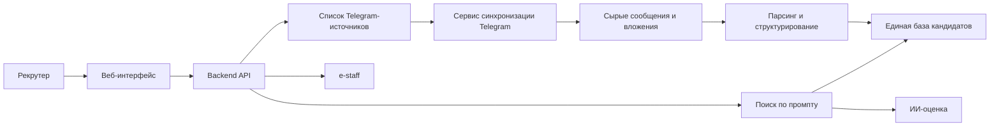

# Техническая документация: поиск кандидатов из Telegram

## 1. Назначение

Документ описывает целевую реализацию функции поиска кандидатов из `Telegram`-каналов и чатов с последующим:

- структурированием кандидатов во внутреннем формате сервиса;
- поиском по текстовому запросу рекрутера;
- оценкой релевантности через языковую модель;
- выгрузкой выбранных кандидатов в `e-staff`.

Документ дополняет текущую спецификацию, в которой основным источником резюме является `HeadHunter`, и задаёт отдельный технический контур для нового источника данных.

## 2. Цель и бизнес-сценарий

Целевой пользовательский сценарий:

1. Рекрутер добавляет в HR-сервис ссылки на нужные `Telegram`-каналы и чаты.
2. Сервис проверяет доступность источников и начинает фоновую синхронизацию сообщений.
3. Из сообщений и вложений извлекаются данные кандидатов.
4. Кандидаты приводятся к единому внутреннему формату.
5. Рекрутер выполняет поиск по промпту так же, как в текущем сценарии поиска через `HeadHunter`.
6. Найденные кандидаты могут быть оценены ИИ и выгружены в `e-staff`.

## 3. Границы реализации

### 3.1 Входит в объём

- добавление и хранение списка `Telegram`-источников;
- проверка доступа к каналам и чатам;
- фоновая загрузка новых сообщений и вложений;
- выделение сообщений, похожих на резюме или самопрезентацию кандидата;
- структурирование данных кандидата из текста и файлов;
- поиск по базе кандидатов, полученных из `Telegram`;
- использование существующего контура ИИ-оценки после адаптации к общему формату кандидата;
- выгрузка кандидата в `e-staff` аналогично текущему пользовательскому сценарию.

### 3.2 Не входит в первый этап

- автоматическая отправка сообщений кандидатам в `Telegram`;
- массовая двусторонняя переписка из интерфейса HR-сервиса;
- обход ограничений приватности `Telegram`;
- поддержка закрытых источников без доступа подключённой учётной записи;
- гарантированное распознавание всех сообщений как полноценных резюме.

## 4. Ключевые ограничения

### 4.1 Особенности источника

`Telegram` не предоставляет стандартизованную базу резюме, аналогичную `HeadHunter`. Источником данных являются:

- текст сообщений;
- прикреплённые файлы (`pdf`, `docx`, `doc`, `txt`);
- ссылки на внешние резюме;
- контактные данные в тексте сообщения.

### 4.2 Текущие ограничения проекта

Текущая реализация сервиса привязана к данным `HeadHunter`:

- в API поиска используется поле `hh_resume_id`;
- избранное хранит кандидата по `hh_resume_id`;
- выгрузка в `e-staff` ожидает идентификатор `hh_resume_id`;
- подготовка кандидата в `e-staff` ориентирована на нормализованное резюме `HeadHunter`.

Для интеграции `Telegram` требуется переход к общему внутреннему формату кандидата, независимому от источника.

## 5. Архитектурный подход

Рекомендуемый подход: не выполнять поиск напрямую по `Telegram` в момент запроса, а строить локальную базу нормализованных кандидатов внутри HR-сервиса.

### 5.1 Общая схема

### 5.2 Принцип разделения контуров

Функция делится на два независимых контура:

1. **Контур синхронизации**: подключение к `Telegram`, чтение сообщений, сохранение сырого содержимого, разбор и нормализация.
2. **Контур поиска**: поиск по уже сохранённой и структурированной базе кандидатов, применение фильтров, сортировка, ИИ-оценка, выгрузка.

Такое разделение уменьшает время ответа при поиске и упрощает контроль качества данных.

## 6. Подключение к Telegram

### 6.1 Способ интеграции

Для чтения каналов и чатов рекомендуется использовать клиентский доступ к `Telegram API`, а не только бота.

Причины:

- бот не подходит для универсального чтения истории произвольных источников;
- чтение групп и чатов зависит от участия подключённой учётной записи;
- для фоновой синхронизации нужен доступ к истории сообщений и вложениям.

### 6.2 Технический компонент

Рекомендуется выделить отдельный сервис `telegram-ingestion` в `Docker Compose`, отвечающий за:

- авторизацию в `Telegram`;
- чтение списка подключённых источников;
- синхронизацию сообщений;
- загрузку вложений;
- публикацию задач на разбор.

### 6.3 Хранение доступа

Необходимо хранить:

- идентификатор приложения `Telegram`;
- секрет приложения;
- сессию подключённой учётной записи;
- метки владельца подключения и среды;
- дату последней успешной синхронизации.

Чувствительные данные должны храниться в зашифрованном виде по правилам, аналогичным хранению других внешних учётных данных в проекте.

## 7. Источники и их жизненный цикл

### 7.1 Сущность источника

Каждый источник должен содержать:

- внутренний идентификатор;
- ссылку;
- тип: `channel`, `group`, `chat`;
- отображаемое имя;
- статус доступа;
- признак активности;
- владельца;
- дату последней проверки;
- дату последней синхронизации;
- текст последней ошибки.

### 7.2 Пользовательские действия

Рекрутер должен иметь возможность:

- добавить ссылку на источник;
- удалить источник;
- временно отключить источник;
- принудительно запустить повторную проверку доступа;
- увидеть статус синхронизации и ошибки.

### 7.3 Проверка источника

При добавлении ссылки система должна:

1. Провалидировать формат ссылки.
2. Определить тип источника.
3. Проверить доступ подключённой учётной записи.
4. Сохранить источник в статусе:
   - `active`;
   - `unavailable`;
   - `access_required`;
   - `invalid`.

## 8. Пайплайн загрузки и обработки данных

### 8.1 Этапы пайплайна

1. Получение списка активных источников.
2. Чтение новых сообщений после последнего курсора.
3. Сохранение сырых сообщений и метаданных.
4. Загрузка вложений при наличии.
5. Первичная классификация: сообщение похоже или не похоже на резюме.
6. Извлечение текста из сообщения и вложений.
7. Нормализация в единый формат кандидата.
8. Поиск дублей и обновление уже существующих карточек.
9. Индексация для поиска.

### 8.2 Какие данные сохраняются как сырьё

Для каждого сообщения рекомендуется сохранять:

- идентификатор сообщения в источнике;
- идентификатор источника;
- дату публикации;
- автора, если доступно;
- текст сообщения;
- ссылку на сообщение;
- тип вложения;
- путь к сохранённому файлу;
- хеш содержимого;
- статус обработки;
- диагностические ошибки разбора.

### 8.3 Первичная классификация сообщений

На первом этапе допускается комбинированный подход:

- простые правила и ключевые признаки;
- эвристический балл похожести на резюме;
- при необходимости дополнительная классификация через языковую модель.

Признаки сообщения-кандидата:

- должность или специализация;
- стек технологий;
- опыт работы;
- город или формат занятости;
- контакты;
- зарплатные ожидания;
- явная формулировка поиска работы.

## 9. Единый внутренний формат кандидата

### 9.1 Причина введения общей модели

Чтобы единообразно поддержать:

- поиск;
- избранное;
- карточку кандидата;
- ИИ-оценку;
- выгрузку в `e-staff`;

необходимо ввести общую внутреннюю сущность кандидата, не зависящую от конкретного источника.

### 9.2 Обязательные поля общей сущности

Минимальный рекомендуемый набор:

- `candidate_id` — внутренний идентификатор;
- `source_type` — `hh` или `telegram`;
- `source_resume_id` — внешний идентификатор источника;
- `source_url` — ссылка на первоисточник;
- `full_name`;
- `title`;
- `area`;
- `experience_years`;
- `skills`;
- `salary`;
- `contacts`;
- `about`;
- `education`;
- `work_experience`;
- `raw_text`;
- `normalized_payload`;
- `parse_confidence`;
- `updated_at`.

### 9.3 Специфика Telegram-кандидата

Для `Telegram` дополнительно рекомендуется хранить:

- ссылку на канал или чат;
- ссылку на сообщение;
- имя источника;
- идентификатор сообщения;
- список вложений;
- дату публикации сообщения;
- признак автообновления по повторным публикациям.

## 10. Дедупликация кандидатов

Один и тот же кандидат может встречаться:

- в нескольких каналах;
- в одном и том же канале повторно;
- одновременно в `Telegram` и `HeadHunter`.

Рекомендуется использовать многоступенчатую дедупликацию:

1. точное совпадение по `email`;
2. точное совпадение по телефону;
3. совпадение по имени и `Telegram`-контакту;
4. похожесть по тексту резюме и навыкам;
5. ручное подтверждение объединения при низкой уверенности.

На первом этапе допустимо объединять только очевидные дубли и сохранять остальные как отдельные карточки с признаком возможного совпадения.

## 11. Поиск по промпту

### 11.1 Общий принцип

Поиск по `Telegram` должен использовать тот же пользовательский сценарий, что и поиск по `HeadHunter`:

- рекрутер вводит текстовый запрос;
- сервис извлекает структурированные критерии;
- применяется поиск по кандидатам;
- выполняется ранжирование;
- при необходимости вызывается ИИ-оценка.

### 11.2 Режимы источников

В интерфейсе поиска рекомендуется ввести выбор источника:

- `HeadHunter`;
- `Telegram`;
- `Все источники`.

### 11.3 Логика поиска для Telegram

Поиск по кандидатам из `Telegram` должен выполняться по:

- структурированным полям кандидата;
- полному тексту сообщения;
- тексту вложений;
- нормализованным навыкам и должностям.

На первом этапе рекомендуется использовать локальный поиск по базе проекта без прямого обращения к `Telegram` во время пользовательского запроса.

## 12. ИИ-оценка кандидатов

### 12.1 Целевой принцип

После выдачи результатов по `Telegram` должен работать тот же пользовательский сценарий оценки, что и для `HeadHunter`:

- числовой балл;
- сильные стороны;
- пробелы;
- краткое summary.

### 12.2 Требование к переиспользованию

Сервис ИИ-оценки должен принимать не `HH`-специфичный объект, а общий нормализованный профиль кандидата.

Для этого требуется:

- вынести общий контракт кандидата для оценки;
- адаптировать формирование входных данных для ИИ;
- обеспечить одинаковый формат ответа для всех источников.

## 13. Выгрузка в e-staff

### 13.1 Целевой принцип

Пользовательский сценарий выгрузки для кандидата из `Telegram` должен быть таким же, как для кандидата из `HeadHunter`.

### 13.2 Требуемое изменение

Контур выгрузки необходимо отвязать от поля `hh_resume_id` и перевести на внутренний идентификатор кандидата.

Рекомендуемое поведение:

1. Пользователь выбирает кандидата.
2. Сервис получает общий нормализованный профиль.
3. Формируется тело запроса в `e-staff`.
4. При отсутствии части обязательных полей сервис:
   - заполняет разрешённые заглушки по настройкам;
   - возвращает предупреждения;
   - запрещает выгрузку только при отсутствии обязательного минимума.

### 13.3 Особенности для Telegram

Для кандидатов из `Telegram` часть полей может отсутствовать чаще, чем для `HeadHunter`:

- фамилия;
- дата рождения;
- полный опыт работы;
- уровень образования;
- телефон или `email`.

Из-за этого документ подготовки кандидата в `e-staff` должен быть расширен с учётом сценария неполных данных из `Telegram`.

## 14. Изменения интерфейса программирования

### 14.1 Новые методы: источники Telegram

Рекомендуемый набор методов:

- `GET /api/v1/telegram/sources`
- `POST /api/v1/telegram/sources`
- `PATCH /api/v1/telegram/sources/{source_id}`
- `DELETE /api/v1/telegram/sources/{source_id}`
- `POST /api/v1/telegram/sources/{source_id}/validate`
- `POST /api/v1/telegram/sources/{source_id}/sync`

### 14.2 Новые методы: служебные операции Telegram

- `GET /api/v1/telegram/status`
- `POST /api/v1/telegram/connect`
- `POST /api/v1/telegram/disconnect`
- `GET /api/v1/telegram/sync-runs`

### 14.3 Изменения существующего поиска

В `POST /api/v1/search` рекомендуется добавить параметр `source_scope`:

- `hh`
- `telegram`
- `all`

При этом формат карточки кандидата должен быть унифицирован и не зависеть от конкретного источника.

### 14.4 Изменения карточки кандидата

Карточка кандидата должна возвращать:

- внутренний идентификатор;
- тип источника;
- внешний идентификатор источника;
- ссылку на первоисточник;
- поле с исходным сообщением или текстом резюме;
- признаки неполноты и предупреждения парсинга.

## 15. Изменения модели данных

### 15.1 Новые таблицы

Рекомендуемый минимальный набор:

- `telegram_accounts`
- `telegram_sources`
- `telegram_sync_runs`
- `telegram_messages`
- `telegram_message_attachments`
- `candidate_profiles`
- `candidate_contacts`
- `candidate_source_links`

### 15.2 Назначение таблиц

`telegram_accounts`
- подключённая учётная запись;
- технические параметры подключения;
- зашифрованная сессия;
- состояние авторизации.

`telegram_sources`
- список каналов и чатов;
- статус доступа;
- курсор синхронизации;
- признак активности.

`telegram_sync_runs`
- история синхронизаций;
- период;
- статус;
- количество обработанных сообщений;
- диагностические ошибки.

`telegram_messages`
- сырой контент сообщения;
- идентификатор источника;
- дата публикации;
- текст;
- ссылка;
- статус разбора.

`telegram_message_attachments`
- связь сообщения с вложением;
- тип файла;
- путь хранения;
- хеш;
- текст, извлечённый из файла.

`candidate_profiles`
- единая карточка кандидата;
- структурированные поля;
- агрегированный текст;
- тип источника;
- данные для поиска и оценки.

`candidate_contacts`
- отдельные контакты кандидата;
- тип контакта;
- значение;
- признак подтверждения.

`candidate_source_links`
- связь кандидата с одним или несколькими исходными сообщениями или внешними резюме.

### 15.3 Изменение существующих сущностей

Потребуется поэтапная адаптация:

- избранного;
- истории поиска;
- карточки кандидата;
- выгрузки в `e-staff`;
- ИИ-оценки.

Главная цель изменений: переход от `hh_resume_id` к внутреннему идентификатору кандидата без потери обратной совместимости на переходном этапе.

## 16. Фоновые задачи

Нужны отдельные фоновые процессы или очереди задач для:

- проверки доступности источников;
- синхронизации сообщений;
- загрузки вложений;
- распознавания текста из файлов;
- структурирования кандидатов;
- дедупликации;
- переиндексации поиска.

Если в проекте пока нет общей очереди задач, допустим первый этап с планировщиком периодических задач внутри отдельного сервисного контейнера.

## 17. Конфигурация

Рекомендуемые переменные окружения:

- `FEATURE_USE_TELEGRAM_SOURCE`
- `TELEGRAM_API_ID`
- `TELEGRAM_API_HASH`
- `TELEGRAM_SESSION_ENCRYPTION_KEY`
- `TELEGRAM_SYNC_ENABLED`
- `TELEGRAM_SYNC_INTERVAL_SECONDS`
- `TELEGRAM_SYNC_BATCH_SIZE`
- `TELEGRAM_MAX_ATTACHMENT_MB`
- `TELEGRAM_ALLOWED_ATTACHMENT_TYPES`
- `TELEGRAM_RESUME_CLASSIFIER_ENABLED`
- `TELEGRAM_RESUME_CLASSIFIER_MIN_SCORE`

При развёртывании в `Docker` сервис синхронизации рекомендуется вынести в отдельный контейнер.

## 18. Безопасность и соответствие требованиям

Необходимо учитывать:

- хранение сессий и токенов только в зашифрованном виде;
- раздельный доступ к пользовательским данным;
- журналирование действий синхронизации без раскрытия чувствительных данных в логах;
- ограничение доступа к карточкам кандидатов по авторизованному пользователю;
- возможность удаления данных по кандидату и источнику;
- документирование правового основания для хранения персональных данных.

## 19. Нефункциональные требования

### 19.1 Производительность

- поиск по локальной базе `Telegram` не должен зависеть от доступности внешнего API в момент запроса;
- первичная выдача поиска должна формироваться без ожидания фоновой синхронизации;
- повторная синхронизация не должна блокировать пользовательский интерфейс.

### 19.2 Надёжность

- сбой синхронизации одного источника не должен останавливать обработку других;
- ошибки разбора отдельных сообщений не должны прерывать общий проход;
- должен сохраняться диагностический след по каждому запуску синхронизации.

### 19.3 Масштабируемость

- архитектура должна допускать добавление новых неофициальных источников по тому же контуру нормализации;
- объём исторических сообщений не должен требовать полного повторного чтения при каждом запуске.

## 20. Этапы внедрения

### Этап 1. Базовая интеграция

- хранение `Telegram`-источников;
- подключение учётной записи;
- фоновая синхронизация сообщений;
- сохранение сырых данных.

### Этап 2. Нормализация кандидатов

- извлечение данных из текста и вложений;
- формирование единой карточки кандидата;
- базовая дедупликация.

### Этап 3. Поиск и ИИ-оценка

- поиск по `Telegram`-кандидатам;
- выбор источника в интерфейсе;
- повторное использование существующего контура ИИ-оценки.

### Этап 4. Выгрузка в e-staff

- адаптация контура выгрузки под общий формат кандидата;
- предупреждения по неполным данным;
- пакетная выгрузка кандидатов из `Telegram`.

### Этап 5. Объединённый поиск

- единый поиск по `HeadHunter` и `Telegram`;
- объединение дублей;
- единая карточка кандидата с несколькими источниками.

## 21. Основные проектные риски

- нестабильность и ограничения чтения отдельных `Telegram`-источников;
- неполнота данных кандидатов;
- высокая доля шумовых сообщений;
- дубли одного кандидата;
- необходимость переработки существующих `HH`-ориентированных контрактов;
- дополнительные требования к защите персональных данных.

## 22. Решения, рекомендуемые к утверждению до начала разработки

Перед стартом реализации необходимо согласовать:

1. Будет ли использоваться единая внутренняя сущность кандидата уже на первом этапе.
2. Допускается ли переход API и БД с `hh_resume_id` на универсальный идентификатор кандидата.
3. Какая учётная запись `Telegram` используется для чтения источников: общая сервисная или пользовательская.
4. Допускается ли обработка вложений на первом этапе.
5. Нужен ли единый поиск по `HeadHunter` и `Telegram` сразу или только отдельный режим `Telegram`.

## 23. Критерии готовности

Функция считается реализованной на целевом уровне, если:

- рекрутер может добавить источник `Telegram`;
- система синхронизирует сообщения и сохраняет диагностический статус;
- из сообщений формируются структурированные карточки кандидатов;
- по этим карточкам работает поиск по промпту;
- для результата поиска доступна ИИ-оценка;
- кандидат из `Telegram` может быть выгружен в `e-staff`;
- ошибки синхронизации, разбора и выгрузки видны в интерфейсе и в журналах.
