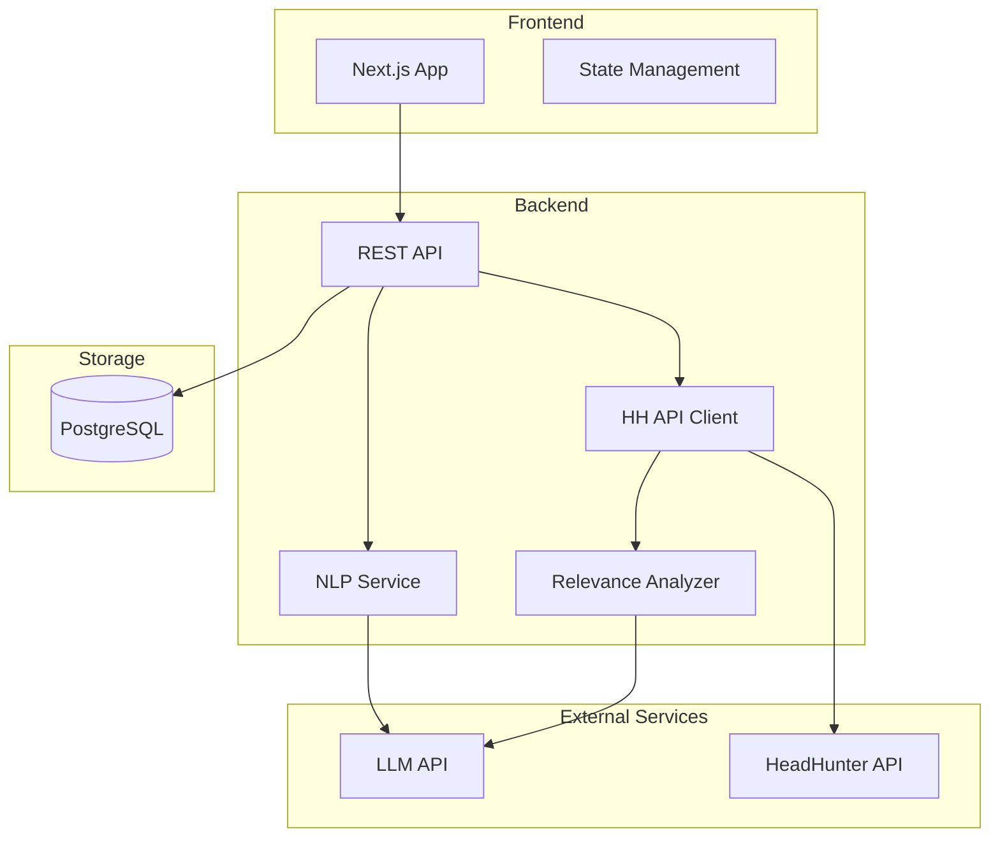
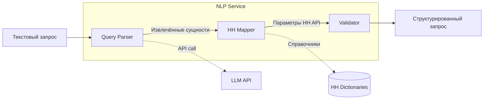
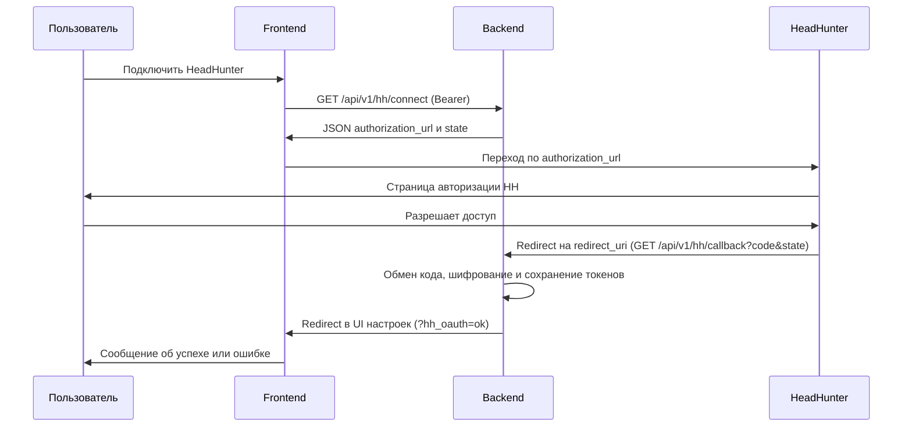
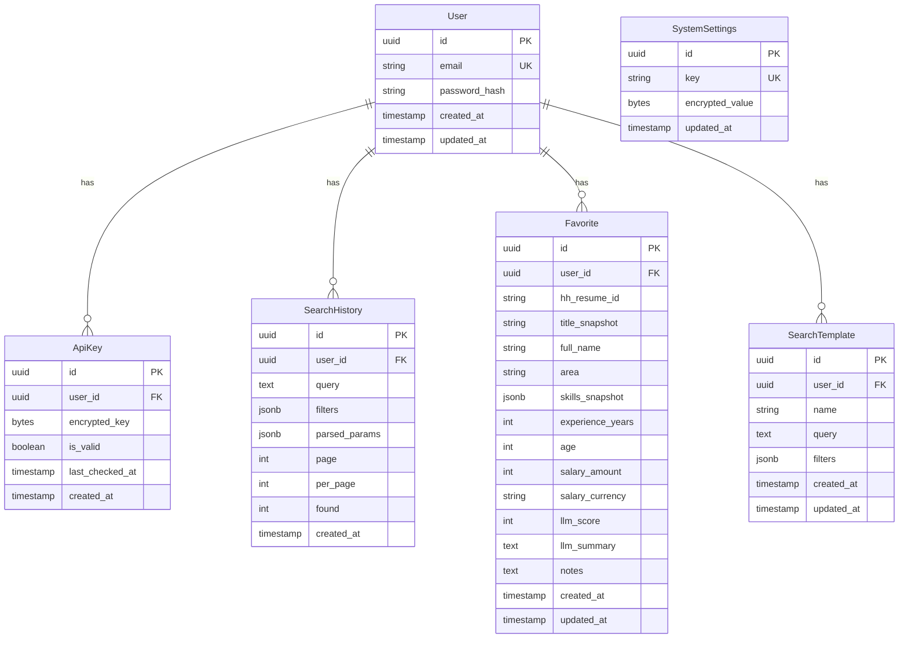

# Техническая спецификация: HR-сервис поиска кандидатов

## 1. Введение

**Проект:** HR-сервис интеграции с HeadHunter

**Назначение:** Веб-приложение для поиска кандидатов через API HeadHunter с использованием естественного языка и интеллектуальной обработки запросов.

### 1.1 Объём документа и целевая аудитория

**Объём:** в одном документе описана **вся система** — веб-интерфейс, сервер приложения (REST), база данных и внешние сервисы (HeadHunter, языковая модель). Отдельного документа «только сервер» не ведётся; раздел с описанием интерфейса программирования задаёт контракт для веб-клиента и любых будущих клиентов.

**Аудитория:** разработка и сопровождение продукта; служба информационной безопасности; внешние подрядчики по доработке (по согласованию доступа к репозиторию и секретам).

### 1.2 Версия продукта и правило обновления

В метаданных сервера приложения зафиксирована версия **0.1.0**. При подготовке релиза версию в коде и актуальность разделов этой спецификации (интерфейс, конфигурация, модель данных) проверяют в одной цепочке задач; в конце документа ведётся **история изменений** (дата, кратко что изменилось).

### 1.3 Оглавление

1. [Введение](#1-введение) (объём, аудитория, версия, оглавление, связанные документы, сверка с кодом)
2. [Архитектура системы](#2-архитектура-системы)
3. [Технологический стек](#3-технологический-стек)
4. [ИИ-компонент (NLP)](#4-ии-компонент-nlp)
5. [Интеграция с HeadHunter API](#5-интеграция-с-headhunter-api)
6. [Модель данных](#6-модель-данных)
7. [Структура проекта](#7-структура-проекта)
8. [Описание интерфейса программирования (REST)](#8-api-reference)
9. [Необходимое ПО и сервисы](#9-необходимое-по-и-сервисы)
10. [Roadmap реализации](#10-roadmap-реализации)
11. [Безопасность](#11-безопасность)
12. [Конфигурация и переменные окружения](#12-конфигурация-и-переменные-окружения)
13. [Ограничения и допущения API HeadHunter](#13-ограничения-и-допущения-api-headhunter)
14. [Стратегия тестирования](#14-стратегия-тестирования)
15. [Нефункциональные требования (NFR)](#15-нефункциональные-требования-nfr)
16. [Приложение A: справочники HeadHunter](#приложение-a-справочники-headhunter)

**Детализация пайплайна поиска и пост-фильтрации** вынесена в отдельный файл: [Поиск-режимы.md](Поиск-режимы.md) (режимы `STRICT_FILTER_MODE`, лимиты LLM на выдаче и т.д.).

### 1.4 Связанные документы

- [Требования.md](Требования.md)
- [User Stories.md](User%20Stories.md)
- [Поиск-режимы.md](Поиск-режимы.md) — режимы поиска, пост-фильтрация, параметры LLM на списке
- [Условия использования API HeadHunter](https://dev.hh.ru/admin/developer_agreement)
- [Документация HeadHunter API](https://github.com/hhru/api)

### 1.5 Сверка с кодом: зафиксированные расхождения

Ниже — отличия **текущей реализации** от устаревших формулировок ранней редакции спецификации и элементы, которые в коде **ещё не реализованы** (целевое поведение или пример).

| Область | В коде / фактически | Комментарий |
|--------|---------------------|-------------|
| Проверка работоспособности | `GET /health` без префикса `/api` | Не описывалось в старой таблице методов |
| OAuth HeadHunter | `GET /api/v1/hh/connect` возвращает JSON с `authorization_url`; обмен кода — `POST /api/v1/hh/connect` с полями `code` и `state`; браузерный callback — `GET /api/v1/hh/callback` | Раньше в тексте фигурировал редирект 302 с `GET /connect` и тело только с `code` |
| Учётные данные приложения HH | `GET` и `PUT /api/v1/hh/credentials` (хранение в БД, шифрование) | В ранней версии документа не отражено |
| Профиль пользователя | `GET /api/v1/auth/me` | В ранней версии документа не отражено |
| История поиска | Пагинация `skip` и `limit`; поля записи: `query`, `page`, `per_page`, `found` | Раньше: `page`/`per_page`, `query_text`, `results_count` |
| Избранное | Список без пагинации; снимок кандидата — отдельные поля (`title_snapshot`, `full_name`, …), не один JSON `resume_snapshot` | Схема БД и API изменены |
| Шаблоны | Список — JSON-массив; у шаблона есть текстовое поле `query` | Раньше описывалась обёртка `items`/`total` без `query` |
| Поиск | Ответ включает `summary`, опционально `llm_analysis` и `strict_match`; `per_page` не более 50; фильтры — схема `ResumeSearchFilters` (скалярные поля, не массив `area`) | См. раздел 8 и [Поиск-режимы.md](Поиск-режимы.md) |
| Карточка и PDF | `GET /api/v1/candidates/{resume_id}`, PDF — `GET /api/v1/candidates/{resume_id}/pdf` (при включённом флаге) | Раньше PDF был только как `/candidates/{hh_resume_id}/pdf` в общем списке методов |
| Отладка парсинга | `POST /api/v1/search/parse/debug` | Только для разработки, требует авторизации |
| Переменные окружения | Имена из `config.py` (через pydantic-settings, обычно **ВЕРХНИЙ РЕГИСТР** в `.env`); ключ шифрования — `TOKEN_ENCRYPTION_KEY`; срок access-токена по умолчанию **30 минут** | Раньше: `ENCRYPTION_KEY`, 15 минут в тексте про JWT |
| Флаги возможностей | `FEATURE_USE_MOCK_LLM`, `FEATURE_USE_MOCK_HH`, `FEATURE_LLM_RESUME_ANALYSIS` и др. | В старом тексте были другие имена (`FEATURE_NLP_STREAMING`, `FEATURE_ANALYTICS` — **в коде не используются**) |
| Ограничение частоты запросов | В коде не реализовано | Пункты про лимиты NLP/поиска в разделе 11 — целевые требования |
| SSE / streaming поиска | Не реализовано | Пример в разделе 4 — опциональная идея |

---

## 2. Архитектура системы

### 2.1 Обзор архитектуры

Система построена по принципу клиент-серверной архитектуры с отдельным NLP-сервисом для обработки запросов на естественном языке.



### 2.2 Компоненты системы

| Компонент | Описание |
|-----------|----------|
| **Frontend** | SPA для взаимодействия с пользователем |
| **Backend API** | REST API для бизнес-логики |
| **NLP Service** | Сервис обработки естественного языка |
| **HH Client** | Клиент для работы с HeadHunter API |
| **Relevance Analyzer** | Сервис оценки релевантности резюме через LLM |
| **PostgreSQL** | Основное хранилище данных |

---

## 3. Технологический стек

### 3.1 Frontend

| Технология | Версия | Назначение |
|------------|--------|------------|
| **Next.js** | 14.x | React-фреймворк с SSR |
| **React** | 18.x | UI-библиотека |
| **TypeScript** | 5.x | Типизация |
| **Tailwind CSS** | 3.x | Стилизация |
| **shadcn/ui** | latest | UI-компоненты |
| **TanStack Query** | 5.x | Управление серверным состоянием |
| **Zustand** | 4.x | Клиентское состояние |
| **React Hook Form** | 7.x | Работа с формами |
| **Zod** | 3.x | Валидация данных |

#### Mobile Responsiveness

Приложение использует mobile-first подход с адаптивной вёрсткой.

**Breakpoints (Tailwind CSS):**

| Breakpoint | Размер | Устройства |
|------------|--------|------------|
| `sm` | ≥640px | Большие телефоны (landscape) |
| `md` | ≥768px | Планшеты |
| `lg` | ≥1024px | Ноутбуки |
| `xl` | ≥1280px | Десктопы |
| `2xl` | ≥1536px | Большие мониторы |

**Адаптивность ключевых компонентов:**

| Компонент | Mobile (<768px) | Desktop (≥768px) |
|-----------|-----------------|------------------|
| **Навигация** | Hamburger меню | Горизонтальное меню |
| **Поле поиска** | Полная ширина | Фиксированная ширина |
| **Панель фильтров** | Выдвижная панель (drawer) | Боковая панель |
| **Список кандидатов** | Карточки в 1 колонку | Grid 2-3 колонки |
| **Карточка кандидата** | Компактный вид | Полный вид с деталями |
| **Таблицы** | Горизонтальный scroll | Обычное отображение |

**Пример адаптивного компонента:**

```tsx
function CandidateList({ candidates }: { candidates: Candidate[] }) {
  return (
    <div className="grid grid-cols-1 md:grid-cols-2 lg:grid-cols-3 gap-4">
      {candidates.map(candidate => (
        <CandidateCard 
          key={candidate.id} 
          candidate={candidate}
          compact={useMediaQuery('(max-width: 768px)')}
        />
      ))}
    </div>
  );
}
```

### 3.2 Backend

| Технология | Версия | Назначение |
|------------|--------|------------|
| **Python** | 3.11+ | Язык программирования |
| **FastAPI** | 0.110+ | Web-фреймворк |
| **SQLAlchemy** | 2.x | ORM |
| **Alembic** | 1.x | Миграции БД |
| **Pydantic** | 2.x | Валидация и сериализация |
| **httpx** | 0.27+ | HTTP-клиент (async) |
| **python-jose** | 3.x | JWT-токены |
| **cryptography** | 42+ | Шифрование API-ключей |

### 3.3 База данных и инфраструктура

| Технология | Назначение |
|------------|------------|
| **PostgreSQL 16** | Основная СУБД |
| **Docker** | Контейнеризация |
| **Docker Compose** | Локальная разработка |

---

## 4. ИИ-компонент (NLP)

### 4.1 Задача

Извлечение структурированных параметров поиска из текстового запроса на русском языке.

**Пример:**
```
Вход: "Найди мне мужчину с опытом разработки на Java в ритейле"

Выход:
{
  "gender": "male",
  "skills": ["Java"],
  "industry": ["retail"],
  "position_keywords": ["разработчик", "developer"],
  "experience_years_min": null,
  "experience_years_max": null,
  "region": null,
  "age_min": null,
  "age_max": null
}
```

### 4.2 Архитектура NLP-сервиса



### 4.3 Выбор LLM-модели

Система использует **внутреннюю LLM компании** для обработки NLP-запросов и оценки релевантности резюме.

| Параметр | Значение |
|----------|----------|
| **Тип** | Корпоративная инфраструктура |
| **Endpoint** | Указывается в `INTERNAL_LLM_ENDPOINT` |
| **Аутентификация** | Bearer token через `INTERNAL_LLM_API_KEY` |
| **Формат API** | OpenAI-совместимый (chat completions) |

**Требуется уточнить у инфраструктурной команды:**
> - Точный URL endpoint внутренней LLM
> - Формат аутентификации (API key / OAuth / другое)
> - Название модели для параметра `model`
> - Лимиты запросов (rate limits)
> - Поддержка JSON-режима (`response_format: {"type": "json_object"}`)

### 4.4 Системный промпт

```python
SYSTEM_PROMPT = """
Ты - ассистент для парсинга HR-запросов на поиск кандидатов.
Извлеки параметры поиска из текста пользователя.

Верни ТОЛЬКО валидный JSON со следующими полями:
- gender: "male" | "female" | null
- skills: массив строк (технологии, языки программирования, инструменты)
- industry: массив строк (отрасли: retail, fintech, gamedev и т.д.)
- position_keywords: массив ключевых слов для должности
- experience_years_min: число или null
- experience_years_max: число или null
- region: строка (город/регион) или null
- age_min: число или null
- age_max: число или null

Правила:
1. Если параметр не указан явно - верни null
2. Навыки извлекай на английском (Java, Python, SQL)
3. Отрасли переводи в стандартные термины (ритейл -> retail)
4. Для опыта "от 3 лет" -> experience_years_min: 3
5. Для возраста "до 35" -> age_max: 35
"""
```

### 4.5 Пример кода интеграции

```python
import httpx
from pydantic import BaseModel
from app.config import settings

class ParsedQuery(BaseModel):
    gender: str | None = None
    skills: list[str] = []
    industry: list[str] = []
    position_keywords: list[str] = []
    experience_years_min: int | None = None
    experience_years_max: int | None = None
    region: str | None = None
    age_min: int | None = None
    age_max: int | None = None

async def call_internal_llm(
    system_prompt: str,
    user_message: str,
    json_mode: bool = True
) -> str:
    """Вызов внутренней LLM компании."""
    async with httpx.AsyncClient() as client:
        request_body = {
            "model": settings.INTERNAL_LLM_MODEL,
            "messages": [
                {"role": "system", "content": system_prompt},
                {"role": "user", "content": user_message}
            ]
        }
        
        if json_mode:
            request_body["response_format"] = {"type": "json_object"}
        
        response = await client.post(
            settings.INTERNAL_LLM_ENDPOINT,
            headers={
                "Authorization": f"Bearer {settings.INTERNAL_LLM_API_KEY}",
                "Content-Type": "application/json"
            },
            json=request_body,
            timeout=30.0
        )
        response.raise_for_status()
        result = response.json()
        
        return result["choices"][0]["message"]["content"]

async def parse_query(query: str) -> ParsedQuery:
    """Парсинг текстового запроса через внутреннюю LLM."""
    content = await call_internal_llm(
        system_prompt=SYSTEM_PROMPT,
        user_message=query,
        json_mode=True
    )
    
    return ParsedQuery.model_validate_json(content)
```

### 4.6 Обработка долгих запросов

NLP-запросы к LLM могут занимать значительное время. Для обеспечения хорошего UX необходимо правильно обрабатывать долгие операции.

#### Таймауты

| Операция | Таймаут | Действие при превышении |
|----------|---------|-------------------------|
| LLM API call | 30 секунд | Retry 1 раз, затем ошибка |
| HeadHunter API | 10 секунд | Ошибка с предложением повторить |
| Общий запрос поиска | 45 секунд | Graceful timeout |

#### Реализация таймаутов

```python
import asyncio
from contextlib import asynccontextmanager

class NLPServiceTimeout(Exception):
    pass

@asynccontextmanager
async def timeout_context(seconds: int, message: str):
    try:
        yield
    except asyncio.TimeoutError:
        raise NLPServiceTimeout(message)

async def parse_query_with_timeout(query: str) -> ParsedQuery:
    async with timeout_context(30, "NLP-сервис не ответил вовремя"):
        try:
            return await asyncio.wait_for(
                parse_query(query),
                timeout=30.0
            )
        except asyncio.TimeoutError:
            # Retry один раз
            return await asyncio.wait_for(
                parse_query(query),
                timeout=30.0
            )
```

#### Loading States на Frontend

```typescript
type SearchState = 
  | { status: 'idle' }
  | { status: 'parsing'; message: 'Анализируем запрос...' }
  | { status: 'searching'; message: 'Ищем кандидатов...' }
  | { status: 'success'; data: SearchResult }
  | { status: 'error'; error: string };

function SearchPage() {
  const [state, setState] = useState<SearchState>({ status: 'idle' });
  
  const handleSearch = async (query: string) => {
    setState({ status: 'parsing', message: 'Анализируем запрос...' });
    
    try {
      const parsed = await api.parseQuery(query);
      setState({ status: 'searching', message: 'Ищем кандидатов...' });
      
      const results = await api.search(parsed);
      setState({ status: 'success', data: results });
    } catch (error) {
      setState({ status: 'error', error: getErrorMessage(error) });
    }
  };
  
  return (
    <>
      {state.status === 'parsing' && <LoadingSpinner text={state.message} />}
      {state.status === 'searching' && <LoadingSpinner text={state.message} />}
      {/* ... */}
    </>
  );
}
```

#### SSE для Streaming (опционально)

Для улучшения UX можно использовать Server-Sent Events для streaming ответов:

```python
from fastapi import Response
from sse_starlette.sse import EventSourceResponse

async def search_stream(query: str):
    yield {"event": "status", "data": "parsing"}
    parsed = await parse_query(query)
    
    yield {"event": "parsed", "data": parsed.model_dump_json()}
    yield {"event": "status", "data": "searching"}
    
    results = await hh_client.search(parsed)
    yield {"event": "results", "data": results}
    
    yield {"event": "done", "data": ""}

@app.get("/api/v1/search/stream")
async def search_with_streaming(query: str):
    return EventSourceResponse(search_stream(query))
```

### 4.7 Оценка релевантности резюме

После получения резюме от HH API система прогоняет их через внутреннюю LLM для оценки соответствия исходному запросу.

#### Задача анализатора

Relevance Analyzer оценивает каждое резюме по следующим критериям:
- **Навыки (skills_match)** — соответствие технических навыков
- **Опыт (experience_match)** — соответствие требуемому опыту работы
- **Отрасль (industry_match)** — релевантность отраслевого опыта
- **Должность (position_match)** — соответствие должностных обязанностей
- **Регион (location_match)** — географическое соответствие

#### Системный промпт для оценки релевантности

```python
RELEVANCE_PROMPT = """
Ты - ассистент для оценки релевантности резюме кандидата поисковому запросу HR-специалиста.

Оцени соответствие резюме запросу по следующим критериям (от 0 до 100):
- skills_match: соответствие технических навыков и технологий
- experience_match: соответствие требуемому опыту работы (годы, уровень)
- industry_match: релевантность отраслевого опыта
- position_match: соответствие должностных обязанностей и роли
- location_match: географическое соответствие (регион, готовность к переезду)

Верни ТОЛЬКО валидный JSON со следующими полями:
- overall_score: общий балл релевантности (0-100)
- skills_match: балл по навыкам (0-100)
- experience_match: балл по опыту (0-100)
- industry_match: балл по отрасли (0-100)
- position_match: балл по должности (0-100)
- location_match: балл по региону (0-100)
- recommendation: "strong_match" | "good_match" | "partial_match" | "weak_match"
- summary: краткое обоснование оценки (1-2 предложения на русском)

Правила:
1. overall_score = взвешенное среднее всех критериев
2. При отсутствии информации по критерию ставь 50 (нейтральная оценка)
3. recommendation зависит от overall_score: ≥80 strong, ≥60 good, ≥40 partial, <40 weak
4. summary должен объяснять главные причины оценки
"""
```

#### Pydantic-модель результата

```python
from pydantic import BaseModel, Field
from typing import Literal

class RelevanceResult(BaseModel):
    overall_score: int = Field(..., ge=0, le=100, description="Общий балл релевантности")
    skills_match: int = Field(..., ge=0, le=100, description="Соответствие навыков")
    experience_match: int = Field(..., ge=0, le=100, description="Соответствие опыта")
    industry_match: int = Field(..., ge=0, le=100, description="Соответствие отрасли")
    position_match: int = Field(..., ge=0, le=100, description="Соответствие должности")
    location_match: int = Field(..., ge=0, le=100, description="Соответствие региона")
    recommendation: Literal["strong_match", "good_match", "partial_match", "weak_match"]
    summary: str = Field(..., max_length=500, description="Краткое обоснование")
```

#### Пример функции анализа релевантности

```python
import httpx
from app.config import settings

async def analyze_relevance(
    resume_data: dict,
    search_query: str,
    parsed_params: ParsedQuery
) -> RelevanceResult:
    """Оценивает релевантность резюме поисковому запросу через LLM."""
    
    prompt = f"""
Поисковый запрос: {search_query}

Распознанные критерии:
- Навыки: {', '.join(parsed_params.skills) or 'не указаны'}
- Опыт: {parsed_params.experience_years_min or 'любой'} - {parsed_params.experience_years_max or 'любой'} лет
- Отрасль: {', '.join(parsed_params.industry) or 'любая'}
- Регион: {parsed_params.region or 'любой'}

Резюме кандидата:
- Должность: {resume_data.get('title', 'не указана')}
- Опыт: {resume_data.get('total_experience', {}).get('months', 0) // 12} лет
- Навыки: {', '.join(resume_data.get('skill_set', []))}
- Регион: {resume_data.get('area', {}).get('name', 'не указан')}
"""
    
    async with httpx.AsyncClient() as client:
        response = await client.post(
            settings.INTERNAL_LLM_ENDPOINT,
            headers={
                "Authorization": f"Bearer {settings.INTERNAL_LLM_API_KEY}",
                "Content-Type": "application/json"
            },
            json={
                "model": settings.INTERNAL_LLM_MODEL,
                "messages": [
                    {"role": "system", "content": RELEVANCE_PROMPT},
                    {"role": "user", "content": prompt}
                ],
                "response_format": {"type": "json_object"}
            },
            timeout=30.0
        )
        response.raise_for_status()
        result = response.json()
    
    return RelevanceResult.model_validate_json(
        result["choices"][0]["message"]["content"]
    )
```

#### Пороговая фильтрация

По умолчанию система фильтрует кандидатов с `overall_score < 30`. Порог настраивается через параметр запроса.

```python
async def search_with_relevance(
    query: str,
    min_relevance: int = 30
) -> list[CandidateWithRelevance]:
    """Поиск с фильтрацией по релевантности."""
    parsed = await parse_query(query)
    resumes = await hh_client.search_resumes(parsed)
    
    results = []
    for resume in resumes:
        relevance = await analyze_relevance(resume, query, parsed)
        if relevance.overall_score >= min_relevance:
            results.append(CandidateWithRelevance(
                **resume,
                relevance=relevance
            ))
    
    return sorted(results, key=lambda x: x.relevance.overall_score, reverse=True)
```

---

## 5. Интеграция с HeadHunter API

### 5.1 Аутентификация

HeadHunter API использует OAuth 2.0. Для работы с резюме требуется токен доступа работодателя.

**Важно:** поиск и просмотр резюме — платные методы. Пользователь должен иметь оплаченную услугу «Доступ к базе резюме» на HeadHunter.

```python
class HHClient:
    BASE_URL = "https://api.hh.ru"
    
    def __init__(self, access_token: str):
        self.headers = {
            "Authorization": f"Bearer {access_token}",
            "User-Agent": "HR-Service/1.0 (contact@example.com)"  # Обязательный заголовок
        }
```

**Требования к User-Agent:**
- Формат: `AppName/Version (contact-email)`
- Заголовок **обязателен** — без него API вернёт ошибку 400
- Некорректный User-Agent может попасть в чёрный список

### 5.1.1 OAuth 2.0 Flow

HeadHunter использует стандартный Authorization Code Flow для OAuth 2.0.

#### Sequence Diagram



Альтернатива (без браузерного callback на сервер): после получения `code` и `state` с зарегистрированного redirect URI клиент вызывает **`POST /api/v1/hh/connect`** с телом `code` и `state`.

#### Параметры OAuth

| Параметр | Значение |
|----------|----------|
| Authorization URL | `https://hh.ru/oauth/authorize` |
| Token URL | `https://hh.ru/oauth/token` |
| Grant Type | `authorization_code` |
| Scope | По умолчанию (доступ к резюме) |

#### Особенности refresh_token HeadHunter

**Важно:** в HeadHunter `refresh_token` можно использовать **только один раз**. После использования выдаётся новый `refresh_token`.

```python
async def refresh_hh_token(user_id: UUID, refresh_token: str) -> TokenPair:
    """Обновление токена HH. Важно: refresh_token одноразовый!"""
    async with httpx.AsyncClient() as client:
        response = await client.post(
            "https://hh.ru/oauth/token",
            data={
                "grant_type": "refresh_token",
                "refresh_token": refresh_token,
                "client_id": settings.HH_CLIENT_ID,
                "client_secret": settings.HH_CLIENT_SECRET,
            }
        )
        data = response.json()
        
        # Сохраняем НОВЫЙ refresh_token (старый уже недействителен)
        await save_encrypted_tokens(
            user_id=user_id,
            access_token=data["access_token"],
            refresh_token=data["refresh_token"],  # Новый токен!
            expires_at=datetime.utcnow() + timedelta(seconds=data["expires_in"])
        )
        
        return TokenPair(
            access_token=data["access_token"],
            refresh_token=data["refresh_token"]
        )
```

#### Хранение токенов

Токены HeadHunter шифруются AES-256-GCM перед сохранением в БД:

```python
from cryptography.hazmat.primitives.ciphers.aead import AESGCM

class TokenEncryption:
    def __init__(self, key: bytes):
        self.aesgcm = AESGCM(key)
    
    def encrypt(self, token: str) -> bytes:
        nonce = os.urandom(12)
        ciphertext = self.aesgcm.encrypt(nonce, token.encode(), None)
        return nonce + ciphertext
    
    def decrypt(self, encrypted: bytes) -> str:
        nonce, ciphertext = encrypted[:12], encrypted[12:]
        return self.aesgcm.decrypt(nonce, ciphertext, None).decode()
```

#### Автоматическое обновление токена

При получении ошибки `token_expired` система автоматически обновляет токен:

```python
async def hh_request_with_refresh(
    user_id: UUID,
    method: str,
    url: str,
    **kwargs
) -> httpx.Response:
    """Выполняет запрос к HH API с автоматическим обновлением токена."""
    tokens = await get_user_tokens(user_id)
    
    response = await hh_client.request(
        method, url,
        headers={"Authorization": f"Bearer {tokens.access_token}"},
        **kwargs
    )
    
    if response.status_code == 401:
        error = response.json()
        if error.get("error") == "token_expired":
            # Автоматическое обновление
            new_tokens = await refresh_hh_token(user_id, tokens.refresh_token)
            # Повторяем запрос с новым токеном
            response = await hh_client.request(
                method, url,
                headers={"Authorization": f"Bearer {new_tokens.access_token}"},
                **kwargs
            )
    
    return response
```

### 5.2 Используемые эндпоинты

| Эндпоинт | Метод | Назначение |
|----------|-------|------------|
| `/resumes` | GET | Поиск резюме |
| `/resumes/{resume_id}` | GET | Получение резюме |
| `/areas` | GET | Справочник регионов |
| `/professional_roles` | GET | Справочник должностей |
| `/industries` | GET | Справочник отраслей |
| `/skills` | GET | Справочник навыков |
| `/employer/managers` | GET | Проверка токена |

### 5.3 Параметры поиска резюме

| Параметр API | Описание | Пример |
|--------------|----------|--------|
| `text` | Текст поиска | "Java developer" |
| `area` | ID региона | 1 (Москва) |
| `professional_role` | ID должности | 96 (Программист) |
| `industry` | ID отрасли | 7 (IT) |
| `skill` | ID навыка | 1 (Java) |
| `experience` | Опыт работы | between3And6 |
| `gender` | Пол | male, female |
| `age_from`, `age_to` | Возраст | 25, 35 |
| `per_page` | Кол-во на странице | 20 |
| `page` | Номер страницы | 0 |

### 5.4 Маппинг параметров

```python
EXPERIENCE_MAP = {
    (0, 1): "noExperience",
    (1, 3): "between1And3",
    (3, 6): "between3And6",
    (6, None): "moreThan6",
}

def map_experience(years_min: int | None, years_max: int | None) -> str | None:
    if years_min is None:
        return None
    for (min_y, max_y), value in EXPERIENCE_MAP.items():
        if years_min >= min_y and (max_y is None or years_min < max_y):
            return value
    return None
```

### 5.5 Кэширование справочников

Справочники HH API (регионы, должности, отрасли) редко меняются. Используем in-memory кэш с TTL.

```python
import time
from typing import Any

class InMemoryCache:
    """Простой in-memory кэш с TTL."""
    
    def __init__(self):
        self._cache: dict[str, tuple[Any, float]] = {}
    
    def get(self, key: str) -> Any | None:
        if key in self._cache:
            value, expires_at = self._cache[key]
            if time.time() < expires_at:
                return value
            del self._cache[key]
        return None
    
    def set(self, key: str, value: Any, ttl: int = 86400) -> None:
        self._cache[key] = (value, time.time() + ttl)

cache = InMemoryCache()

async def get_areas(hh_client: HHClient) -> list[dict]:
    cached = cache.get("hh:areas")
    if cached:
        return cached
    
    areas = await hh_client.get("/areas")
    cache.set("hh:areas", areas, ttl=86400)  # 24 часа
    return areas
```

---

## 6. Модель данных

### 6.1 ER-диаграмма



### 6.2 Описание таблиц

**users** — пользователи системы
- `id` — первичный ключ (UUID)
- `email` — уникальный email для входа
- `password_hash` — хэш пароля (bcrypt)

**api_keys** — API-ключи HeadHunter
- `encrypted_key` — зашифрованный токен (AES-256)
- `is_valid` — результат последней проверки
- `last_checked_at` — время последней валидации

**search_history** — история поисковых запросов
- `query` — исходный текст запроса
- `filters` — выбранные фильтры (JSON)
- `parsed_params` — распознанные параметры от NLP
- `page`, `per_page` — параметры страницы запроса к поиску
- `found` — число найденных резюме (как сообщил слой HeadHunter/мок)

**favorites** — избранные кандидаты
- `hh_resume_id` — идентификатор резюме на HeadHunter
- снимок для списка: `title_snapshot`, `full_name`, `area`, `skills_snapshot`, `experience_years`, `age`, `salary_amount`, `salary_currency`, при необходимости `llm_score`, `llm_summary`
- `notes` — заметки пользователя
- уникальность пары `(user_id, hh_resume_id)`

**search_templates** — сохранённые шаблоны поиска
- `name` — название шаблона
- `query` — сохранённый текст запроса (естественный язык)
- `filters` — сохранённые фильтры (JSON)

**system_settings** — ключ–значение для глобальных настроек (значение в БД в зашифрованном виде)
- используется, в частности, для хранения `client_id` / `client_secret` / `redirect_uri` OAuth-приложения HeadHunter (ключ строки, например `hh_credentials`)

---

## 7. Структура проекта

### 7.1 Backend (Python/FastAPI)

```
backend/
├── app/
│   ├── __init__.py
│   ├── main.py                 # Точка входа FastAPI
│   ├── config.py               # Конфигурация
│   ├── api/
│   │   ├── __init__.py
│   │   ├── deps.py             # Зависимости (DI)
│   │   ├── auth.py             # Аутентификация
│   │   ├── search.py           # Поиск кандидатов
│   │   ├── favorites.py        # Избранное
│   │   ├── history.py          # История запросов
│   │   └── templates.py        # Шаблоны поиска
│   ├── services/
│   │   ├── __init__.py
│   │   ├── nlp_service.py      # NLP-обработка
│   │   ├── hh_client.py        # Клиент HH API
│   │   ├── relevance_service.py # Сервис оценки релевантности
│   │   ├── encryption.py       # Шифрование ключей
│   │   ├── mapper.py           # Маппинг параметров
│   │   └── pdf_generator.py    # Генерация PDF резюме
│   ├── models/
│   │   ├── __init__.py
│   │   ├── user.py
│   │   ├── api_key.py
│   │   ├── search_history.py
│   │   ├── favorite.py
│   │   ├── search_template.py
│   │   └── system_settings.py
│   ├── schemas/
│   │   ├── __init__.py
│   │   ├── auth.py
│   │   ├── search.py
│   │   └── candidate.py
│   └── db/
│       ├── __init__.py
│       ├── session.py          # Сессия БД
│       └── base.py             # Base model
├── alembic/                    # Миграции
├── tests/
├── requirements.txt
├── Dockerfile
└── docker-compose.yml
```

### 7.2 Frontend (Next.js)

```
frontend/
├── app/
│   ├── layout.tsx              # Root layout
│   ├── page.tsx                # Главная (редирект)
│   ├── (auth)/
│   │   ├── login/page.tsx
│   │   └── register/page.tsx
│   ├── search/
│   │   └── page.tsx            # Страница поиска
│   ├── candidates/
│   │   ├── page.tsx            # Список результатов
│   │   └── [id]/page.tsx       # Карточка кандидата
│   ├── favorites/
│   │   └── page.tsx
│   ├── history/
│   │   └── page.tsx
│   └── settings/
│       └── page.tsx            # Настройки API-ключа
├── components/
│   ├── ui/                     # shadcn/ui компоненты
│   ├── SearchInput.tsx         # Поле ввода запроса
│   ├── FilterPanel.tsx         # Панель фильтров
│   ├── CandidateCard.tsx       # Карточка кандидата
│   ├── CandidateList.tsx       # Список кандидатов
│   ├── StatusIndicator.tsx     # Статус подключения
│   ├── ParsedTags.tsx          # Теги распознанных параметров
│   ├── RelevanceScore.tsx      # Общий балл релевантности
│   ├── RelevanceDetails.tsx    # Детальная разбивка по критериям
│   └── RelevanceBar.tsx        # Визуальный прогресс-бар релевантности
├── lib/
│   ├── api.ts                  # API-клиент
│   ├── auth.ts                 # Хелперы авторизации
│   └── utils.ts
├── hooks/
│   ├── useSearch.ts
│   ├── useFavorites.ts
│   └── useApiStatus.ts
├── stores/
│   └── filterStore.ts          # Zustand store
├── types/
│   └── index.ts
├── package.json
├── tailwind.config.ts
├── next.config.js
└── Dockerfile
```

---

## 8. API Reference

### 8.1 Общие сведения

Публичные методы с префиксом **`/api/v1`**. Формат тела запросов и ответов — **JSON**. Для защищённых методов в заголовке **`Authorization: Bearer <access_token>`** передаётся JWT.

Отдельно без префикса API объявлена проверка готовности процесса: **`GET /health`** → `{"status": "ok"}` (без авторизации).

Сводная таблица маршрутов (имена параметров пути — как в коде):

| Метод | Путь | Назначение |
|-------|------|------------|
| GET | `/health` | Проверка работоспособности |
| POST | `/api/v1/auth/register` | Регистрация |
| POST | `/api/v1/auth/login` | Вход |
| POST | `/api/v1/auth/refresh` | Обновление пары токенов |
| GET | `/api/v1/auth/me` | Текущий пользователь |
| GET | `/api/v1/hh/connect` | URL для начала OAuth (JSON) |
| POST | `/api/v1/hh/connect` | Обмен кода авторизации на токены |
| GET | `/api/v1/hh/callback` | Редирект от HeadHunter в интерфейс (настройки) |
| GET | `/api/v1/hh/status` | Статус подключения к HeadHunter |
| GET | `/api/v1/hh/credentials` | Сохранены ли учётные данные OAuth-приложения |
| PUT | `/api/v1/hh/credentials` | Сохранить client_id / secret / redirect_uri |
| POST | `/api/v1/search` | Поиск с разбором запроса |
| POST | `/api/v1/search/parse` | Только разбор запроса |
| POST | `/api/v1/search/parse/debug` | Сырой ответ языковой модели (отладка) |
| GET | `/api/v1/favorites` | Список избранного |
| POST | `/api/v1/favorites` | Добавить в избранное |
| DELETE | `/api/v1/favorites/{favorite_id}` | Удалить из избранного |
| PATCH | `/api/v1/favorites/{favorite_id}/notes` | Заметки |
| GET | `/api/v1/history` | История поисков |
| GET | `/api/v1/templates` | Список шаблонов |
| POST | `/api/v1/templates` | Создать шаблон |
| PUT | `/api/v1/templates/{template_id}` | Обновить шаблон |
| DELETE | `/api/v1/templates/{template_id}` | Удалить шаблон |
| GET | `/api/v1/candidates/{resume_id}` | Карточка кандидата |
| GET | `/api/v1/candidates/{resume_id}/pdf` | PDF резюме (если включён флаг) |

#### Заголовки запросов

| Заголовок | Обязательность | Описание |
|-----------|----------------|----------|
| `Authorization` | Да, кроме регистрации, входа, обновления токена и `/health` | `Bearer <jwt>` |
| `Content-Type` | Да для тел с JSON | `application/json` |

#### Версионирование

В пути зафиксирован сегмент **`v1`**. Версия приложения в метаданных сервера — **0.1.0** (см. раздел 1.2).

---

### 8.2 Аутентификация

#### `POST /api/v1/auth/register`

Регистрация. Поля тела: `email`, `password` (длина 8–128 символов).

**Ошибки:** `409` — email уже занят; ошибки валидации тела — `422` (FastAPI).

---

#### `POST /api/v1/auth/login`

Вход. Ответ `TokenOut`: `access_token`, `refresh_token`, `token_type` (`bearer`), `expires_in` (секунды, произведение `ACCESS_TOKEN_EXPIRE_MINUTES` на 60).

**Ошибки:** `401` — неверный email или пароль.

---

#### `POST /api/v1/auth/refresh`

Тело: `refresh_token`. Ответ — новая пара токенов в формате `TokenOut`.

**Ошибки:** `401` — неверный или просроченный refresh-токен.

---

#### `GET /api/v1/auth/me`

Текущий пользователь: `id`, `email`. Требуется Bearer JWT.

---

### 8.3 Интеграция с HeadHunter

#### `GET /api/v1/hh/connect`

Требуется авторизация. Ответ JSON: `authorization_url` — ссылка для перехода пользователя (реальный OAuth HeadHunter или мок с подставленным `state`).

#### `POST /api/v1/hh/connect`

Тело: `code` (строка от HeadHunter), `state` (обязателен для проверки привязки к пользователю). Успех: `status` (`connected`), `hh_user_id`, `expires_at`.

**Ошибки:** `400` — неверный `state` или код; `503` — OAuth не настроен (при выключенном моке); `502` — сбой обмена кода.

#### `GET /api/v1/hh/callback`

Публичный для браузера редирект от HeadHunter на `redirect_uri` сервера. Параметры строки запроса: `code`, `state` (или `error`). Итог: редирект на страницу настроек веб-приложения с параметрами `hh_oauth=ok|error`.

#### `GET /api/v1/hh/status`

Статус подключения: `connected`, при успехе — `hh_user_id`, `employer_name`, `access_expires_at`, `services`; при отсутствии токена или ошибке чтения — `connected: false` и `message`.

#### `GET /api/v1/hh/credentials`

Ответ: `configured` (есть ли пара client_id/client_secret в БД), `redirect_uri` (эффективный для отображения в UI).

#### `PUT /api/v1/hh/credentials`

Тело: `client_id`, `client_secret`, опционально `redirect_uri`. Сохранение зашифрованной записи в `system_settings`. Ответ: `status: ok`.

---

### 8.4 Поиск кандидатов

#### `POST /api/v1/search`

Тело запроса (`SearchIn`):

| Поле | Тип | Описание |
|------|-----|----------|
| `query` | строка | Текст запроса (до 4000 символов; может быть пустой строкой) |
| `filters` | объект или null | Явные фильтры поиска резюме (см. ниже) |
| `page` | целое, ≥ 0 | Номер страницы (по умолчанию 0) |
| `per_page` | целое, 1–50 | Размер страницы (по умолчанию 20) |

Объект **`ResumeSearchFilters`** (все поля необязательны; лишние ключи в JSON игнорируются):

| Поле | Тип | Назначение |
|------|-----|------------|
| `area` | целое | Идентификатор региона HeadHunter (один регион) |
| `professional_role` | целое | Идентификатор профессиональной роли |
| `industry` | целое | Идентификатор отрасли |
| `skill` | массив целых | Идентификаторы навыков |
| `experience` | перечисление | `noExperience` \| `between1And3` \| `between3And6` \| `moreThan6` |
| `gender` | перечисление | `male` \| `female` |
| `age_from`, `age_to` | целые | Возраст (14–100) |
| `salary_from`, `salary_to` | целые | Зарплата |
| `currency` | строка | Валюта (до 8 символов) |
| `period` | целое ≥ 1 | Период обновления резюме, дней |
| `relocation` | перечисление | `living` \| `living_but_relocation` |
| `education_level` | строка | Уровень образования (до 64 символов) |
| `employment` | массив строк | Занятость |

Ответ (`SearchOut`): массив `items` (элементы `CandidateOut`), `found`, `page`, `pages`, `per_page`, `parsed_params` (без служебного ключа текста запроса), `summary` (`SearchSummary`: `total_found`, `total_relevant`, `strong_matches`, `good_matches`, `weak_matches`).

У каждого кандидата: идентификаторы, поля карточки, блок **`relevance`** (эвристическая оценка), опционально **`llm_analysis`** (если включён анализ языковой моделью), опционально **`strict_match`** (после пост-фильтрации по числовым границам — см. [Поиск-режимы.md](Поиск-режимы.md)).

**Типичные ошибки:** `403` — не подключён HeadHunter (при выключенном моке) или запрет доступа к данным; `503` — недоступен API HeadHunter; коды от клиента HeadHunter пробрасываются как есть.

---

#### `POST /api/v1/search/parse`

Тело: `query` (обязательно), `force_reparse` (логическое, по умолчанию false). Ответ: `parsed_params`, `confidence`, `processing_time_ms`.

---

#### `POST /api/v1/search/parse/debug`

Для отладки: возвращает сырой ответ языковой модели по строке запроса. Требуется авторизация.

---

### 8.5 Избранное

#### `GET /api/v1/favorites`

Возвращает **массив** записей без пагинации. Элемент (`FavoriteOut`): `id`, `hh_resume_id`, снимок полей (`title_snapshot`, `full_name`, `area`, `skills_snapshot`, числовые поля, `llm_score`, `llm_summary`), `notes`, `created_at`, `updated_at`.

---

#### `POST /api/v1/favorites`

Тело (`FavoriteCreateIn`): обязательный `hh_resume_id`; опционально снимок и метаданные (`title_snapshot`, `full_name`, `area`, `skills_snapshot`, `experience_years`, `age`, `salary_amount`, `salary_currency`, `llm_score`, `llm_summary`, `notes` до 8000 символов).

**Ошибки:** `409` — кандидат уже в избранном.

---

#### `DELETE /api/v1/favorites/{favorite_id}`

**Ответ:** `204`. **Ошибки:** `404`.

---

#### `PATCH /api/v1/favorites/{favorite_id}/notes`

Тело: `notes` (до 8000 символов). **Ответ:** полный объект избранного.

---

### 8.6 История запросов

#### `GET /api/v1/history`

Параметры строки запроса: **`skip`** (по умолчанию 0), **`limit`** (по умолчанию 20, не более 100).

Ответ (`SearchHistoryListOut`): `items` — записи с полями `id`, `query`, `filters`, `parsed_params`, `page`, `per_page`, `found`, `created_at`; **`total`** — общее число записей пользователя.

---

### 8.7 Шаблоны поиска

#### `GET /api/v1/templates`

Возвращает **JSON-массив** шаблонов (`SearchTemplateOut`: `id`, `name`, `query`, `filters`, `created_at`, `updated_at`).

---

#### `POST /api/v1/templates`

Тело: `name`, `query`, опционально `filters` (та же схема, что у поиска).

---

#### `PUT /api/v1/templates/{template_id}`

Частичное обновление: любое из `name`, `query`, `filters` (переданные поля заменяются).

---

#### `DELETE /api/v1/templates/{template_id}`

**Ответ:** `204`. **Ошибки:** `404`.

---

### 8.8 Кандидаты и PDF

#### `GET /api/v1/candidates/{resume_id}`

Полная карточка (`CandidateDetailOut`): как у элемента поиска, плюс при наличии связи с избранным — `favorite_id`, `favorite_notes`. Параметр строки запроса **`q`**: необязательный текст для пересчёта релевантности и анализа языковой моделью на странице карточки.

---

#### `GET /api/v1/candidates/{resume_id}/pdf`

При **`FEATURE_PDF_EXPORT=false`** возвращается **`404`** с пояснением. Иначе — двоичный PDF, заголовок `Content-Disposition: attachment`. Нужен доступ к HeadHunter (или мок). **Ошибки:** `403`, `404`, коды клиента HeadHunter.

В реализации данные резюме преобразуются в HTML и затем в PDF средствами сервера (без обязательной выдачи файла напрямую с сайта HeadHunter).

---

## 9. Необходимое ПО и сервисы

### 9.1 Инструменты разработки

| Инструмент | Назначение |
|------------|------------|
| **VS Code** / **Cursor** | IDE |
| **Docker Desktop** | Контейнеризация |
| **Git** | Версионирование |
| **Postman** / **Bruno** | Тестирование API |
| **DBeaver** / **pgAdmin** | Работа с PostgreSQL |

### 9.2 Инфраструктура для Production

| Сервис | Назначение | Альтернативы |
|--------|------------|--------------|
| **Vercel** | Хостинг Frontend | Netlify, Cloudflare Pages |
| **Railway** | Хостинг Backend | Render, Fly.io, VPS |
| **Neon** / **Supabase** | PostgreSQL | Railway Postgres, Managed DB |
| **Внутренняя LLM** | NLP-обработка, оценка релевантности | Корпоративная инфраструктура |

### 9.3 Мониторинг и логирование

| Сервис | Назначение |
|--------|------------|
| **Sentry** | Отслеживание ошибок |
| **Axiom** / **Logtail** | Централизованные логи |
| **Better Uptime** | Мониторинг доступности |

### 9.4 CI/CD

| Инструмент | Назначение |
|------------|------------|
| **GitHub Actions** | CI/CD пайплайны |
| **Vercel CLI** | Деплой Frontend |
| **Railway CLI** | Деплой Backend |

---

### 9.5 Backup и восстановление

#### PostgreSQL

| Параметр | Значение |
|----------|----------|
| **Частота backup** | Ежедневно в 03:00 UTC |
| **RPO (Recovery Point Objective)** | 24 часа |
| **RTO (Recovery Time Objective)** | 1 час |
| **Хранение копий** | 30 дней |
| **Тип backup** | pg_dump (полный) + WAL-архивирование (incremental) |

**Стратегия backup:**

```bash
# Автоматический ежедневный backup (cron)
0 3 * * * pg_dump -Fc hr_service > /backups/hr_service_$(date +%Y%m%d).dump

# Восстановление из backup
pg_restore -d hr_service /backups/hr_service_20240115.dump
```

**Managed PostgreSQL (Neon/Supabase):**
- Автоматические daily backups включены в тариф
- Point-in-time recovery (PITR) до 7 дней
- Репликация между зонами доступности

#### Процедура восстановления

1. **Определить точку восстановления** (timestamp последнего рабочего backup)
2. **Остановить приложение** (graceful shutdown)
3. **Восстановить БД** из backup
4. **Запустить приложение** и проверить работоспособность
5. **Уведомить пользователей** о возможной потере данных за период после backup

---

## 10. Roadmap реализации

### Фаза MVP

| Компонент | User Stories | Описание |
|-----------|--------------|----------|
| Auth | US-1.1 | Регистрация, вход, хранение API-ключа |
| NLP | US-2.1, US-2.2 | Парсинг запросов через LLM |
| Поиск | US-4.1 | Базовый поиск и отображение результатов |
| Статус | US-1.2 | Проверка подключения к HH |

**Результат:** Работающий прототип с поиском по тексту

---

### Фаза v1.0

| Компонент | User Stories | Описание |
|-----------|--------------|----------|
| Фильтры | US-3.1, US-3.2 | Панель фильтров + синхронизация с текстом |
| Детали | US-4.2 | Полная карточка кандидата |
| Избранное | US-4.3 | Сохранение кандидатов |
| Ошибки | US-6.2 | Обработка ошибок API |

**Результат:** Полнофункциональный поиск с фильтрами

---

### Фаза v1.1

| Компонент | User Stories | Описание |
|-----------|--------------|----------|
| История | US-5.1 | История запросов |
| Шаблоны | US-5.2 | Сохранение шаблонов |
| UX | US-6.1 | Подсказки при пустых результатах |
| Варианты | US-3.3 | Множественные соответствия |

**Результат:** Улучшенный UX и повторное использование запросов

---

### Фаза v1.2

| Компонент | User Stories | Описание |
|-----------|--------------|----------|
| Синхронизация | US-3.4 | Двусторонняя синхронизация фильтры ↔ текст |
| Оптимизация | — | Кэширование, производительность |
| Аналитика | — | Статистика поисков |

**Результат:** Финальная версия с полной функциональностью

---

## 11. Безопасность

### 11.1 Хранение секретов

- Токены HeadHunter и прочие чувствительные структуры хранятся в БД в зашифрованном виде (см. сервис шифрования в коде)
- Ключ для шифрования указывается в **`TOKEN_ENCRYPTION_KEY`**
- Пары client_id/client_secret OAuth-приложения HeadHunter могут храниться в таблице `system_settings` (тоже шифрование)
- Пароли пользователей — bcrypt

### 11.2 Аутентификация

- JWT access-токен: длительность задаётся **`ACCESS_TOKEN_EXPIRE_MINUTES`** (в коде по умолчанию 30 минут); в ответе логина поле `expires_in` — в секундах
- Refresh-токен: срок **`REFRESH_TOKEN_EXPIRE_DAYS`**
- Алгоритм подписи: **`JWT_ALGORITHM`** (по умолчанию HS256)
- В production обязателен HTTPS

### 11.3 Ограничение частоты запросов (целевое требование)

В текущей версии кода **не реализовано**. Ниже — ориентир для дальнейшей доработки:

- Ограничение запросов к разбору текста (NLP): порядка 10 запросов в минуту на пользователя
- Ограничение поиска: порядка 30 запросов в минуту на пользователя
- Реализация: память процесса для одного экземпляра или общее хранилище при нескольких экземплярах

### 11.4 Требования HeadHunter к безопасности данных

- Приложение **НЕ хранит** данные резюме дольше необходимого (только snapshot для избранного)
- Приложение **НЕ передаёт** данные резюме третьим лицам
- Приложение **НЕ собирает** логины и пароли пользователей HH
- Приложение **НЕ выполняет** действия в API без ведома пользователя
- При блокировке API-ключа — уведомление пользователя и graceful degradation
- Соблюдение актуальности данных — удаление архивных вакансий/резюме

---

## 12. Конфигурация и переменные окружения

Настройки сервера задаются классом **`Settings`** в `backend/app/config.py` и подхватываются из переменных окружения и файла **`.env`** в каталоге backend (имена переменных для pydantic-settings обычно совпадают с полями в **ВЕРХНЕМ РЕГИСТРЕ**). Реальные секреты в документ не копируют.

### 12.1 Таблица переменных (сервер приложения)

| Переменная (типичное имя в .env) | Назначение | Значение по умолчанию в коде |
|----------------------------------|------------|------------------------------|
| `DATABASE_URL` | Строка подключения к PostgreSQL | `postgresql://hr:hr@localhost:5432/hr_service` |
| `SECRET_KEY` | Секрет подписи JWT | `change-me-in-production` |
| `ACCESS_TOKEN_EXPIRE_MINUTES` | Срок access-токена, минуты | `30` |
| `REFRESH_TOKEN_EXPIRE_DAYS` | Срок refresh-токена, дни | `7` |
| `JWT_ALGORITHM` | Алгоритм JWT | `HS256` |
| `TOKEN_ENCRYPTION_KEY` | Ключ для шифрования полезной нагрузки в БД | пусто (нужно задать в среде) |
| `HH_CLIENT_ID`, `HH_CLIENT_SECRET`, `HH_REDIRECT_URI` | OAuth-приложение HeadHunter (если не заданы только через API настроек) | redirect по умолчанию `http://localhost:8000/api/v1/hh/callback` |
| `FEATURE_USE_MOCK_LLM` | Использовать мок языковой модели | `true` |
| `FEATURE_USE_MOCK_HH` | Использовать мок HeadHunter | `true` |
| `INTERNAL_LLM_ENDPOINT` | URL API в стиле OpenAI (чат) | пусто |
| `INTERNAL_LLM_API_KEY` | Ключ или заглушка для LLM | `ollama` |
| `INTERNAL_LLM_MODEL` | Имя модели | `llama3.2` |
| `FEATURE_PDF_EXPORT` | Включить выдачу PDF резюме | `false` |
| `FEATURE_ADVANCED_FILTERS` | Расширенные фильтры (зарезервировано) | `false` |
| `FEATURE_LLM_RESUME_ANALYSIS` | Дополнительный анализ резюме через LLM в поиске и на карточке | `false` |
| `LLM_RELEVANCE_THRESHOLD` | Порог для эвристики (используется в сервисах релевантности) | `60` |
| `LLM_ANALYSIS_MIN_SCORE` | Минимальный эвристический балл для вызова LLM на выдаче | `40` |
| `LLM_SEARCH_MAX_CANDIDATES` | Максимум резюме на странице с вызовом LLM | `15` |
| `LLM_SEARCH_BATCH_SIZE` | Размер пакета для LLM (1 — по одному резюме) | `1` |
| `LLM_ANALYSIS_HARD_FLOOR` | Ниже этого эвристического балла LLM не вызывается | `0` |
| `STRICT_NUMERIC_FILTERS` | Пост-фильтрация по числовым границам из разобранного запроса | `true` |
| `STRICT_FILTER_MODE` | `hide` — убрать неподошедших; `demote` — оставить с `strict_match=false` | `hide` |
| `RELEVANCE_WEIGHT_SKILLS` и др. | Веса критериев эвристической релевантности | см. `config.py` |
| `CORS_ORIGINS` | Разрешённые источники для CORS (через запятую) | `http://localhost:3000,http://127.0.0.1:3000` |

Детали поведения поиска и пост-фильтрации — в [Поиск-режимы.md](Поиск-режимы.md).

### 12.2 Клиент веб-приложения

Адрес сервера API для браузера задаётся в окружении фронтенда (например **`NEXT_PUBLIC_API_URL`**), значение зависит от схемы развёртывания.

---

## 13. Ограничения и допущения API HeadHunter

### 13.1 Условия доступа к API

| Требование | Описание |
|------------|----------|
| **Регистрация приложения** | Обязательна на [dev.hh.ru](https://dev.hh.ru) |
| **Срок рассмотрения заявки** | До **15 рабочих дней** |
| **Право отказа** | HeadHunter вправе отказать без объяснения причин и компенсации |
| **Учетная запись** | Требуется аккаунт работодателя на hh.ru |
| **Обжалование** | Возможно в течение 15 календарных дней через dev.hh.ru |

### 13.2 Платные функции

**Важно:** поиск и просмотр резюме — платные функции HeadHunter

| Функция | Требование |
|---------|------------|
| **Поиск резюме** | Требует оплаченной услуги "Доступ к базе резюме" |
| **Просмотр резюме** | Требует оплаченной услуги |
| **Просмотр контактов** | Списывается 1 контакт за каждое новое резюме |
| **Лимиты просмотров** | Ежедневный лимит на менеджера (настраивается работодателем) |

**Модель списания контактов (с 1 августа 2020):**
- Соискатель откликнулся сам → контакты видны **бесплатно**
- Работодатель ищет резюме → нужно **списать контакт**
- Контакт уже списан ранее → контакты видны **бесплатно**

### 13.3 Правовые ограничения использования

#### Разрешённое использование:
- Публикация вакансий
- Приглашение соискателей на вакансии
- Поиск по базе резюме для целей трудоустройства
- Контакт с соискателями для найма

#### Запрещённое использование:

| Запрет | Пункт условий |
|--------|---------------|
| Оценка кредитоспособности соискателей | п. 1.6 |
| Маркетинговые опросы и исследования | п. 1.6 |
| Рекламные рассылки без согласия | п. 4.7 |
| Формирование собственной базы резюме для перепродажи | п. 4.3 |
| Передача данных резюме сторонним сервисам | п. 4.6 |
| Сбор и хранение логинов/паролей пользователей HH | п. 3.6 |
| Маскировка под официальное приложение HH | п. 3.5 |
| Использование товарных знаков HeadHunter | п. 3.4 |
| Автоматические действия без ведома пользователя | п. 4.9 |

### 13.4 Технические ограничения

#### Лимиты запросов

| Ограничение | Описание |
|-------------|----------|
| **Лимит просмотров в сутки** | Ограничен для каждого менеджера |
| **Квота менеджера** | Устанавливается работодателем |
| **Лимит API запросов** | Для метода просмотра резюме (`API_LIMITED`) |
| **Глубина пагинации** | ~2000 записей максимум |

#### Параметры пагинации

| Параметр | Значение |
|----------|----------|
| `per_page` | Максимум **100** элементов |
| `page` | Нумерация с **0** |

#### Требования к запросам

| Требование | Описание |
|------------|----------|
| **User-Agent** | Обязательный заголовок (иначе ошибка 400) |
| **Домен авторизации** | Только `hh.ru` (не `m.hh.ru`) |
| **refresh_token** | Можно использовать только **1 раз** |

### 13.5 Скрытые поля в анонимных резюме

| Тип скрытия | Скрытые поля |
|-------------|--------------|
| `names_and_photo` | `first_name`, `last_name`, `middle_name`, `photo` |
| `phones` | Телефоны (`cell`, `work`, `home`) |
| `email` | Email-адрес |
| `other_contacts` | Ссылки на соцсети |
| `experience` | Название компаний, employer |

### 13.6 Обработка ошибок API

#### HTTP-коды ответов

| Код | Значение |
|-----|----------|
| `400` | Ошибка в параметрах запроса |
| `403` | Доступ запрещён / нет оплаченных услуг |
| `404` | Ресурс не найден |
| `429` | Превышен лимит запросов |
| `503` | Сервис временно недоступен |

#### Критичные ошибки для обработки

```python
HH_API_ERRORS = {
    # Платные методы
    ("api_access_payment", "action_must_be_payed"): "Требуется оплата услуги доступа к базе резюме",
    
    # Лимиты
    ("resumes", "view_limit_exceeded"): "Превышен дневной лимит просмотров резюме",
    ("resumes", "quota_exceeded"): "Превышена квота просмотров, установленная менеджеру",
    ("resumes", "no_available_service"): "Не хватает услуг для просмотра резюме",
    ("resumes", "cant_view_contacts"): "Нет прав на просмотр контактов",
    
    # Авторизация
    ("oauth", "bad_authorization"): "Токен авторизации недействителен",
    ("oauth", "token_expired"): "Срок действия токена истёк",
    ("oauth", "token_revoked"): "Токен отозван пользователем",
    
    # Защита
    ("captcha_required", "captcha_required"): "Требуется пройти капчу",
}
```

### 13.7 Защита от автоматизации

| Механизм | Описание |
|----------|----------|
| **Капча** | Некоторые операции защищены капчей |
| **Чёрный список User-Agent** | Блокировка подозрительных клиентов |
| **Мониторинг активности** | HH отслеживает подозрительную активность |
| **Блокировка приложения** | Возможна при нарушении условий |

### 13.8 Допущения для реализации

1. **Пользователь имеет оплаченный доступ к базе резюме на HH** — это не расходы сервиса, а расходы HR-менеджера/компании
2. **Регистрация приложения одобрена** — процесс до 15 рабочих дней с риском отказа
3. **OAuth-токен пользователя валиден** — каждый пользователь использует свой токен
4. **Данные резюме не хранятся долгосрочно** — только snapshot для избранного
5. **Приложение не передаёт данные третьим лицам**

### 13.9 Риски и митигация

| Риск | Вероятность | Митигация |
|------|-------------|-----------|
| Отказ в регистрации приложения | Средняя | Подготовка детального описания, соответствие требованиям |
| Блокировка API-ключа | Низкая | Соблюдение условий использования, мониторинг |
| Изменение API без предупреждения | Средняя | Версионирование клиента, graceful degradation |
| Введение платы за ранее бесплатные методы | Средняя | Архитектура с возможностью отключения функций |
| Закрытие публичного API | Низкая | Документирование альтернативных источников |

---

## 14. Стратегия тестирования

### 14.1 Уровни тестирования

| Уровень | Инструменты | Покрытие |
|---------|-------------|----------|
| **Unit-тесты** | pytest (backend), vitest (frontend) | ≥80% критичного кода |
| **Integration-тесты** | pytest + testcontainers | API endpoints, БД |
| **E2E-тесты** | Playwright | Критичные user flows |

### 14.2 Backend тестирование (pytest)

```python
# tests/test_nlp_service.py
import pytest
from app.services.nlp_service import parse_query

@pytest.mark.asyncio
async def test_parse_query_with_skills():
    result = await parse_query("Найди Java-разработчика")
    assert "Java" in result.skills
    assert result.position_keywords

@pytest.mark.asyncio
async def test_parse_query_with_region():
    result = await parse_query("Разработчик в Москве")
    assert result.region == "Москва"
```

### 14.3 Frontend тестирование (vitest)

```typescript
// __tests__/SearchInput.test.tsx
import { render, screen, fireEvent } from '@testing-library/react';
import { SearchInput } from '@/components/SearchInput';

describe('SearchInput', () => {
  it('should call onSearch when form submitted', async () => {
    const onSearch = vi.fn();
    render(<SearchInput onSearch={onSearch} />);
    
    fireEvent.change(screen.getByRole('textbox'), {
      target: { value: 'Java developer' }
    });
    fireEvent.submit(screen.getByRole('form'));
    
    expect(onSearch).toHaveBeenCalledWith('Java developer');
  });
});
```

### 14.4 E2E тестирование (Playwright)

```typescript
// e2e/search.spec.ts
import { test, expect } from '@playwright/test';

test('user can search for candidates', async ({ page }) => {
  await page.goto('/search');
  
  await page.fill('[data-testid="search-input"]', 'Python developer');
  await page.click('[data-testid="search-button"]');
  
  await expect(page.locator('[data-testid="results-list"]')).toBeVisible();
  await expect(page.locator('[data-testid="candidate-card"]')).toHaveCount({ min: 1 });
});
```

### 14.5 Тестовые данные и моки

**Мок HeadHunter API:**

```python
# tests/mocks/hh_api.py
import respx
from httpx import Response

@respx.mock
async def test_search_with_mocked_hh():
    respx.get("https://api.hh.ru/resumes").mock(
        return_value=Response(200, json={
            "items": [{"id": "123", "title": "Developer"}],
            "found": 1,
            "pages": 1
        })
    )
    
    result = await hh_client.search_resumes({"text": "Java"})
    assert len(result.items) == 1
```

### 14.6 CI Pipeline

```yaml
# .github/workflows/test.yml
name: Tests
on: [push, pull_request]

jobs:
  backend:
    runs-on: ubuntu-latest
    services:
      postgres:
        image: postgres:16
        env:
          POSTGRES_PASSWORD: test
    steps:
      - uses: actions/checkout@v4
      - uses: actions/setup-python@v5
        with:
          python-version: '3.11'
      - run: pip install -r requirements.txt
      - run: pytest --cov=app --cov-report=xml
      
  frontend:
    runs-on: ubuntu-latest
    steps:
      - uses: actions/checkout@v4
      - uses: actions/setup-node@v4
        with:
          node-version: '20'
      - run: npm ci
      - run: npm run test:coverage
      
  e2e:
    runs-on: ubuntu-latest
    steps:
      - uses: actions/checkout@v4
      - run: docker-compose up -d
      - run: npx playwright install
      - run: npx playwright test
```

---

## 15. Нефункциональные требования (NFR)

### 15.1 Производительность

| Метрика | Целевое значение | Измерение |
|---------|------------------|-----------|
| **Время отклика API (p95)** | < 500ms | Без учёта внешних API |
| **Время NLP-парсинга** | < 2s | Включая LLM API call |
| **Время загрузки страницы (LCP)** | < 3s | Lighthouse |
| **Time to Interactive (TTI)** | < 5s | Lighthouse |

### 15.2 Доступность

| Метрика | Целевое значение |
|---------|------------------|
| **Uptime** | ≥99.5% (кроме planned maintenance) |
| **Planned maintenance** | Не более 4 часов в месяц |
| **MTTR (Mean Time To Recovery)** | < 1 час |

### 15.3 Масштабируемость

| Параметр | Значение |
|----------|----------|
| **Concurrent users** | До 100 одновременно |
| **Requests per second** | До 50 RPS |
| **Database connections** | Pool size: 20 |

### 15.4 Безопасность

См. [раздел 11](#11-безопасность). Кратко: шифрование при передаче и хранении, настраиваемый срок JWT, ограничение частоты запросов — как целевое требование (в коде пока не включено).

### 15.5 Мониторинг SLA

```python
# Пример алерта в Sentry
sentry_sdk.init(
    traces_sample_rate=0.1,
    profiles_sample_rate=0.1,
)

# Алерт при p95 > 500ms
@app.middleware("http")
async def track_response_time(request: Request, call_next):
    start = time.perf_counter()
    response = await call_next(request)
    duration = time.perf_counter() - start
    
    if duration > 0.5:  # 500ms
        logger.warning(f"Slow request: {request.url} took {duration:.2f}s")
    
    return response
```

---

## История изменений документа

| Дата | Изменения |
|------|-----------|
| 2026-03-24 | Зафиксированы объём документа (вся система) и аудитория; версия продукта 0.1.0 и правило обновления; добавлены оглавление, ссылка на [Поиск-режимы.md](Поиск-режимы.md), таблица сверки с кодом; раздел REST и конфигурация приведены в соответствие с `main.py`, `config.py` и схемами Pydantic; обновлена модель данных (история, избранное, шаблоны, `system_settings`); выровнена нумерация подразделов в разделах 11 и 13; добавлена эта история. |

---

## Приложение A: Справочники HeadHunter

### Опыт работы (experience)

| Значение | Описание |
|----------|----------|
| noExperience | Нет опыта |
| between1And3 | От 1 до 3 лет |
| between3And6 | От 3 до 6 лет |
| moreThan6 | Более 6 лет |

### Популярные регионы (area)

| ID | Название |
|----|----------|
| 1 | Москва |
| 2 | Санкт-Петербург |
| 3 | Екатеринбург |
| 4 | Новосибирск |
| 113 | Россия (вся) |

### Популярные IT-должности (professional_role)

| ID | Название |
|----|----------|
| 96 | Программист, разработчик |
| 10 | Аналитик |
| 12 | Арт-директор |
| 25 | Дизайнер |
| 165 | Тестировщик |
| 116 | DevOps |
